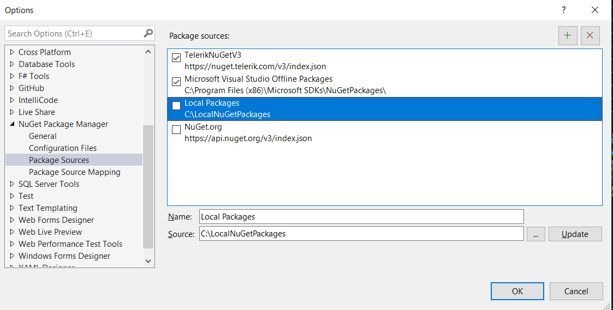
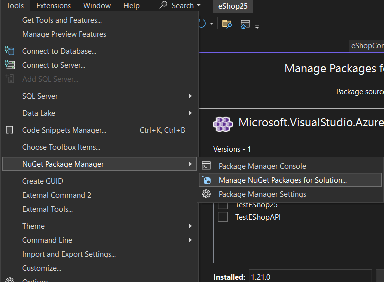
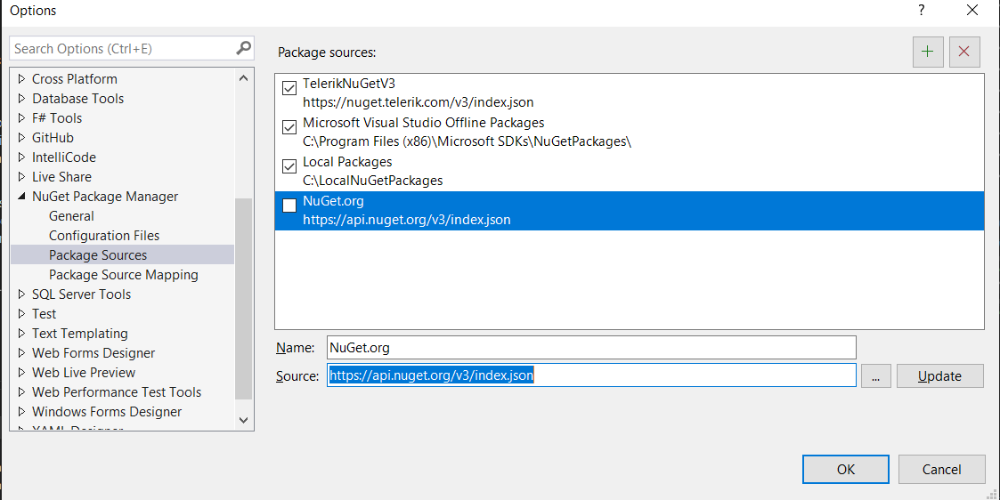

# VS2022 Bugfixes

## Issue 1: Missing "Microsoft.VisualStudio.Azure.Containers.Tools.Targets"
**Error Message:**  
`Microsoft.VisualStudio.Azure.Containers.Tools.Targets` missing

### Solution:
1. **Create a Local NuGet Folder**  
   Create a folder named `LocalNuGetPackages` on your system, e.g.,  
   `C:\LocalNuGetPackages`.

2. **Download the Required Package**  
   Download and place the file `microsoft.visualstudio.azure.containers.tools.targets.1.21.0.nupkg` into this folder.

3. **Add the Folder as a NuGet Package Source**  
   - Open **Tools** > **Options** > **NuGet Package Manager** > **Package Sources**.
   - Click the **+** icon to add a new package source, and point it to your `LocalNuGetPackages` folder.
   - Refer to the image below for guidance:

   

4. **Install the Package**  
   Open the NuGet Package Manager in Visual Studio and install the package.

   

---

## Issue 2: NuGet Source Not Found  
**Error Message:**  
`https://api.nuget.org/v3/index.json` could not be found

### Solution:
1. **Add the NuGet.org Package Source**  
   - Go to **Tools** > **Options** > **NuGet Package Manager** > **Package Sources**.
   - Click **+** to add a new source, and configure it as follows:  
     **Name:** `NuGet.org`  
     **Source:** `https://api.nuget.org/v3/index.json`
   - Refer to the image below for guidance:

   

---

**Written by:** Lynn Delpy  
**Date:** 13.09.2024  
**Prettified by:** ChatGPT

**Copyright©2024 Lynn Delpy All rights reserved**